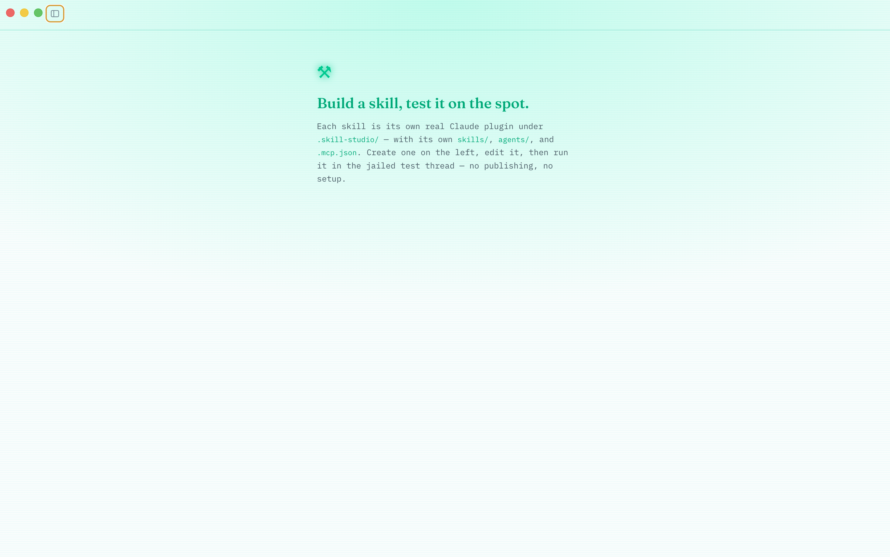

# Fabulist

**An AI-native writing studio for the desktop, powered under the hood by [Claude Code](https://claude.com/claude-code).**

Fabulist is two workspaces in one app, both backed by the real Claude Code engine running
in-process (no sidecar, no server):

- **The writing studio** — every document is a real Claude Code project folder, versioned
  with git, rewindable, and shared with an agent that works *inside* the document's world.
  You write directly, or you highlight, comment, and ask Claude. Every change Claude proposes
  is shown to you as a diff you approve or decline before it touches the text.
- **Skill Studio** — a build-and-test bench for [Claude **skills**](https://claude.com/claude-code).
  Each skill is a real local Claude *plugin* you edit, chat about with an authoring agent, and
  run on the spot in a jailed sandbox — versioned and archived so you can iterate without losing
  your test history.

Switch between the two from the **❡** wordmark dropdown at the top-left.



## The writing studio

- **A real editor first** — CodeMirror 6 markdown editing with manuscript typography. Your
  words live in a plain `document.md` you can open with anything.
- **An agent that knows the document** — chat in the sidebar; Claude reads, researches, and
  edits the doc with full project context (each doc has its own `CLAUDE.md` it loads).
  Per-document model picker, populated live from whatever your Claude Code version offers.
- **Human-approved edits, or auto-apply** — by default Claude's proposed changes render in the
  document itself as Google-Docs-style suggested edits (strikethrough + insertion), with
  accept/decline (⌘⏎ / esc). Flip **Auto-apply edits** to let them land immediately (every run
  is still committed, so History can undo anything). Commands and non-document files surface as
  diff cards in chat. Nothing reaches the document without your approval unless you opt in.
- **Comments are the conversation** — highlight text and comment, like a shared doc. Claude
  reads every comment, replies in the thread, and proposes any text change as a suggested
  edit. Threads are anchored highlights that survive edits and rewrites.
- **Skills** — install Claude Code skills (SKILL.md instruction packs) and toggle them on
  per document; type `/` in the composer to invoke one.
- **Versioned and rewindable** — autosave checkpoints, named snapshots, and automatic commits
  for every approved Claude edit. Preview any version as a diff and restore it; restores commit
  forward, so history is never destroyed.
- **Attachments** — drop files (or paste long text) into the document's `attachments/` folder
  and reference them in a prompt.

## Skill Studio

A separate workspace for authoring and testing Claude skills. Each skill is its own real,
runnable Claude plugin — so what you test is exactly what ships.

- **Each skill is a real plugin** — scaffolded under `~/Documents/Fabulist/.skill-studio/<slug>/`
  with its own `.claude-plugin/plugin.json`, `skills/<slug>/SKILL.md`, `agents/`, and
  `.mcp.json`, listed in a top-level `marketplace.json`. A file tree + CodeMirror editor (with a
  white-on-neon Markdown theme) let you edit the whole plugin; `.md` files get an **Auto-format**
  button (Prettier).
- **An authoring agent** (the **Chat** tab) that reads and edits the skill's files directly.
  Edits arrive as **approval cards** with a diff by default — Apply / Decline — or apply
  immediately with the **Auto-apply edits** toggle. Applied edits show a **Show in file** jump
  that scrolls to and highlights the change. The agent's replies render as **formatted Markdown**.
- **Test it like a real user** — the **Test** tab runs the skill in a throwaway sandbox with the
  plugin loaded off disk (sub-agents and MCP come along), enabling its skills exactly as the
  engine does. Type `/` to invoke a specific skill by name (the natural-language equivalent of
  calling it), or give a plain task and let the model select by description. If the skill asks a
  question, it surfaces as a card you answer — it's never auto-skipped.
- **Versioned, archived test runs** — the live thread is numbered (**TEST v0.0.1**, an odometer
  that carries: `0.0.9`→`0.1.0`, `0.9.9`→`1.0.0`). **New test** archives the current run instead
  of discarding it (a confirm-in-place "Archive current test?"), bumps the version, and opens a
  fresh thread. Past runs are read-only and searchable.
- **Reference a run from the chat** — type `/` in the authoring chat to weave the current test
  run's transcript into your message ("the test did X, fix it"), or pick **Archived** for a
  searchable list of past runs (most-recent-first). Highlight text in a file and **Comment** to
  send a note + the quoted passage into the chat.
- **Persistent** — authoring + test transcripts, the authoring session, the version counter, and
  the archive all persist per skill (in `.skill-studio/.state/<slug>.json`, gitignored) and
  survive a restart. The sidebar is resizable — drag its left edge to widen it.

## Requirements

- macOS (Windows/Linux likely work — packaging targets exist — but are untested)
- [Node.js](https://nodejs.org) 20+
- `git` on your PATH
- A logged-in **Claude Code** installation — Fabulist uses your existing `claude` login
  and plan; it never asks for an API key

## Run it

```bash
git clone <this repo> fabulist && cd fabulist
npm install
npm run dev
```

> If your npm config disables postinstall scripts, run `node node_modules/electron/install.js`
> once to fetch the Electron binary.

Build a standalone app (`.dmg`/`.zip` into `dist/`):

```bash
npm run dist
```

## Where your work lives

Everything is local under `~/Documents/Fabulist/`.

A **document** is one folder:

```
~/Documents/Fabulist/<document>/
  document.md        ← the document itself
  CLAUDE.md          ← per-document instructions Claude loads automatically
  comments.json      ← anchored comment threads (versioned with the doc)
  attachments/       ← files you've attached
  .fabulist/         ← app state: agent session id, chat transcript (gitignored)
  .git/              ← full version history
```

**Skill Studio** lives in a dot-folder beside the documents (so it never shows in the library):

```
~/Documents/Fabulist/.skill-studio/
  .claude-plugin/marketplace.json   ← lists every skill-plugin (regenerated)
  .state/<slug>.json                ← per-skill transcripts, session, test version + archive (gitignored)
  <slug>/                           ← one complete plugin per skill
    .claude-plugin/plugin.json
    skills/<slug>/SKILL.md
    agents/
    .mcp.json
```

## How it works

| Layer | Choice | Why |
|---|---|---|
| Shell | Electron + electron-vite + React | The Claude Agent SDK is a Node library; running it in the main process is the most direct integration possible — no sidecar, no server. |
| Editor | CodeMirror 6 (markdown) | Baremetal; its decoration/range-mapping API powers comment highlights that survive edits, inline suggestions, and the transient "reveal" highlight. |
| Agent | `@anthropic-ai/claude-agent-sdk` | The actual Claude Code engine. For a document, `cwd` = the doc folder and `resume` keeps one continuous session; for Skill Studio, a per-skill authoring session edits the plugin folder and a separate test session runs the plugin (`plugins: [{ type: 'local' }]`, `skills: 'all'`) in a sandbox. |
| Versioning | plain `git` CLI per folder | History = `git log`, rewind = restore from a rev (always committed forward — restoring never erases history). |
| Approval gate | SDK `canUseTool` callback | Read-only tools pass through; file edits and commands surface as inline diffs / approval cards the author approves (unless auto-apply is on). `AskUserQuestion` surfaces as a question card. App-managed files (`comments.json`) are off-limits to the agent. |
| Chat rendering | `react-markdown` + `remark-gfm` | The Skill Studio chat/test/comments render the LLM's Markdown (tables, code, lists). Raw HTML isn't rendered and links open in the system browser, so it's XSS-safe. The document chat and all file editors still show/edit raw source. |

### The approval flow

1. Claude calls `Edit`/`Write` on a file → `canUseTool` fires in the main process.
2. Main computes before/after, sends a permission request over IPC.
3. For the document itself, the editor renders the change inline as a suggested edit
   (old text struck through, new text inserted) and locks the doc while you review;
   commands and other files (and Skill Studio edits) show as diff cards in the panel.
4. On accept, the SDK executes the edit; a file watcher picks up the change and the
   editor updates live; the turn ends with an automatic commit.

## Privacy

Everything is local: your documents, skills, comments, history, and chat transcripts stay in
`~/Documents/Fabulist/`. Conversations with Claude go through your own Claude Code login,
exactly as if you'd run `claude` in that folder yourself.

## Development

- `npm run typecheck` — strict TS over main + renderer
- `npm test` — Vitest regression suite (renderer store, main process, shared)
- `npm run build` — production bundles to `out/`
- `npm run pack` — unpacked app build for quick smoke tests (`dist/`)
- `scripts/cdp.mjs` — dev harness: launch with
  `npm run dev -- -- --remote-debugging-port=9223`, then
  `node scripts/cdp.mjs screenshot /tmp/app.png` or `node scripts/cdp.mjs eval '<js>'`
  (the renderer exposes `window.__store` in dev builds)

Source map:

```
src/main/        Electron main: window, IPC, git, library, comments store,
                 agent.ts (document agent + approval gate),
                 skillStudio.ts / studioAgent.ts (Skill Studio storage + agents)
src/preload/     typed contextBridge API (window.fabulist)
src/shared/      types + IPC channel contract shared across processes
src/renderer/    React app:
                   components/  Library, CodeMirror editor, chat (bubbles, approval
                                cards, Markdown), shared UI
                   studio/      Skill Studio (file tree, authoring chat, test thread,
                                comments, code editor)
                   store/       Zustand slices (doc, chat, comments, permissions,
                                settings, history, skill studio)
```

See [CONTRIBUTING.md](CONTRIBUTING.md) before opening a PR.

## License

[MIT](LICENSE)
